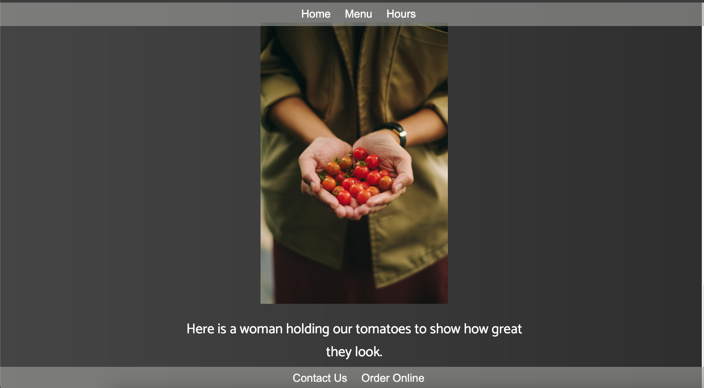

# Restaurant Page
## Project 9: Restaurant App using JavaScript, Webpack, and DOM Manipulation

## Description: 
Welcome to my ninth web development project! This is part of my coursework in The Odin Project, a free, open-source curriculum to learn fullstack web development! 

This project is a restaurant website built using JavaScript, CSS, and Webpack. It features a single-page application design that dynamically generates HTML through DOM manipulation, eliminating the need for multiple static pages. This approach enhances user experience by providing seamless navigation and faster loading times.

## Links:
The full challenge description can be found here: https://www.theodinproject.com/lessons/node-path-javascript-restaurant-page. 

## Demo: 

## Screenshots: 

 